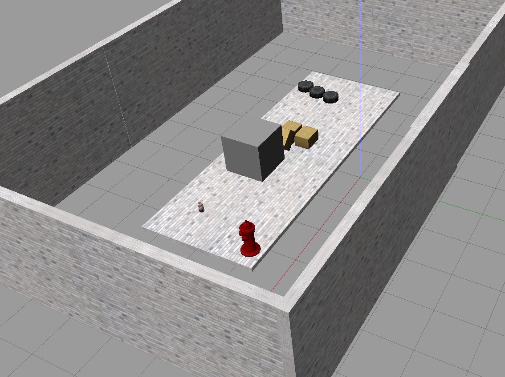
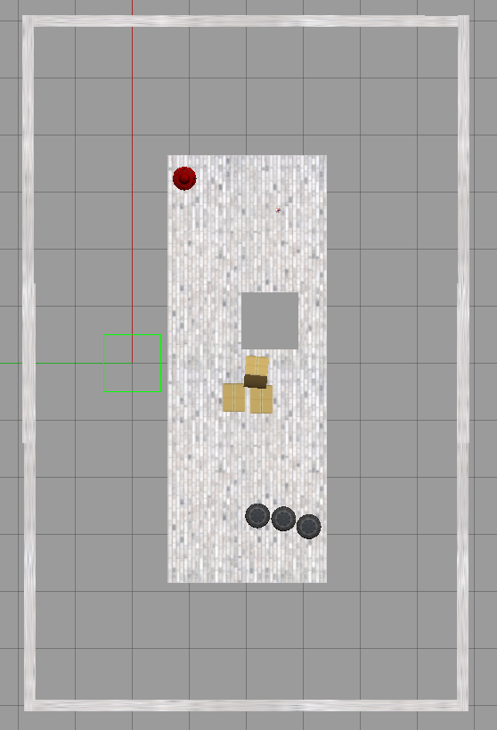

# Környezet felderítése leesésszenzor és ütközésszenzor segítségével

## Table of contents

1. [Bevezető](#Bevezető)
2. [Feladat leírása](#Feladat-leírása)
3. [Megvalósítás](#Megvalósítás)
4. [Eredmények](#Eredmények)

# Bevezető

A mai modern háztartásokban egyre népszerűbbek a különböző háztartási robotok, például robotporszívók. Ezeknél különösen fontos, hogy a "terepviszonyokat" felismerjék, a bútoroknak és egyéb környezeti elemeknek ne ütközzenek neki, illetve a lépcsőn se guruljanak le. Ennek elkerülése érdekében a robot szenzorokkal rendelkezik, melyeknek jelei alapján a beépített számítógép tudja irányítani a robot mozgását.


# Feladat leírása

Csapatunk feladata egy olyan virtuális, önjáró robot fejlesztése volt ROS környezetben, mely az általunk kialakított virtuális környezet elemeit érzékeli, azok között ütközés, illetve a pálya szélén leesés nélkül tud közlekedni. 

# Megvalósítás

A feladatot ROS rendszerben valósítottuk meg, az órán megismert programok használatával, illetve a ROS Community modulok használatával.

A projekthez a következő csomagok telepítése szükséges:
* ros-noetic-full-desktop
* ros-noetic-hector-trajectory-server
* ros-noetic-hector-slam
* ros-noetic-map-server
* ros-noetic-gmapping

## A világ
A feladat megvalósításához létrehoztunk egy saját világot, ahol számos kihívás éri a robotot a térkép elkészítése során. Vannak különböző akadályok elhelyezve a térben, illetve le is eshet a "szakadékba".



## Geometria 
Robotunk geometriája egy hétköznapi robotporszívóra emlékeztet. Egy Z tengely mentén kihúzott lapos henger az alján az X tengelyen két kerékkel, melyeket differenciálisan hajtunk, illetve az Y tengelyre rögzített kettő darab szabadonfutó kerékkel, melyek a robot stabilitásáért felelősek, azonban nincsenek meghajtva. 

## Szenzorok 
A környezet érzékelésének érdekében a robotunk tetején középen egy Lidar szenzort helyeztünk el, mely XY síkban pásztázza a környezetet, majd a visszaverődő lézerfényből távolságot számol és megadja a tereptárgyak illetve az érzékelő közötti távolságot. 

A leesést elkerülendő 3 darab ultrahangos közelségérzékelő szenzort helyeztünk el a robotunk alján körbe, 120 fokos osztásban. Az érzékelés iránya a Z tengellyel párhuzamos. Amennyiben a visszavert ultrahang hullámok a referenciaértéknél (a talaj és a szenzor távolsága) hosszabb idő alatt érkeznek vissza, a robot érzékeli a szakadékot. 

## Irányítás 
A robotunk irányítását a teleop.launch segítségével teszteltük.
Ezután egy random-bejáró algoritmust valósítottunk meg a robottal. Ezt a módszert alkalmazzák például robot-porszívók is egy adott tér bejárására. Az algoritmus pszeudókódja a következő:
```
init_movement()

while True:
    
    while (distance_of_closest_obstacle > reference_value) && fall_not_detected:
        move_forward()
    
    turn_random_angle()
```

## Eredmények

## 12. hét
A robotunk jelenleg kézi irányítással vezérelt, de RViz-ben és Gazebo-ban is látszik, hogy szenzoraink megfelelően érzékelnek. 
