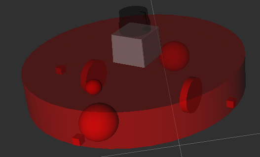
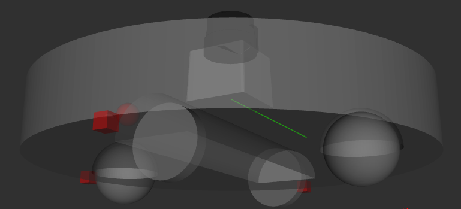
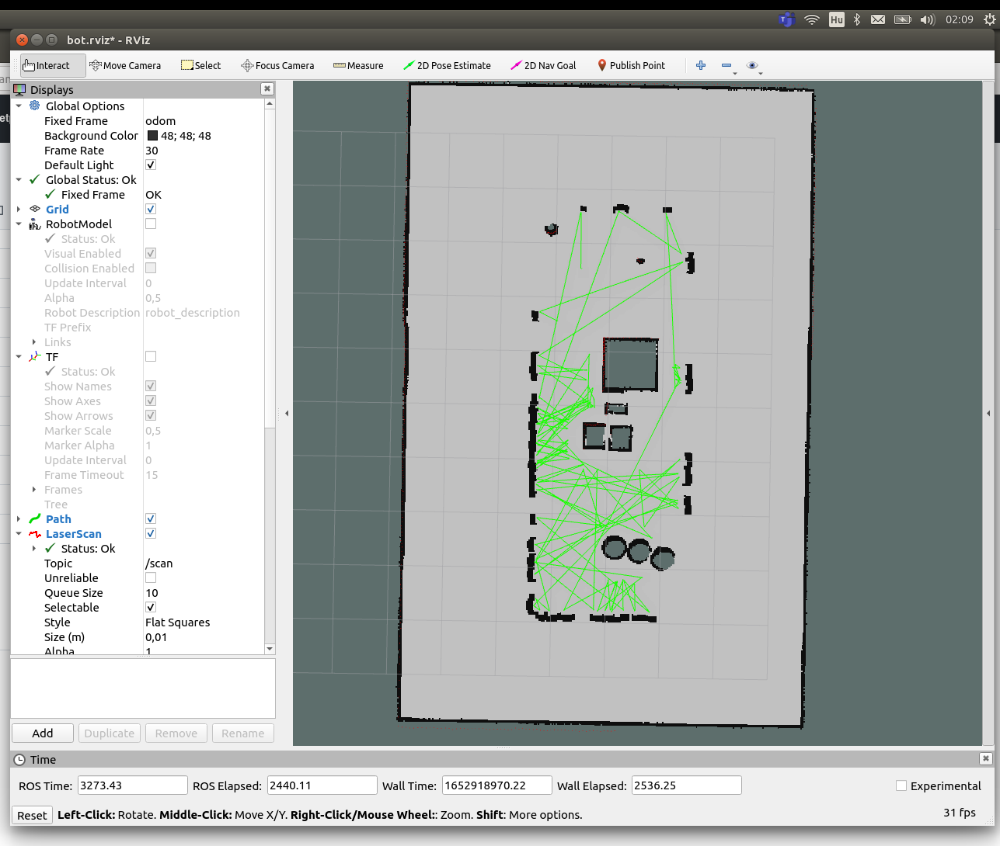
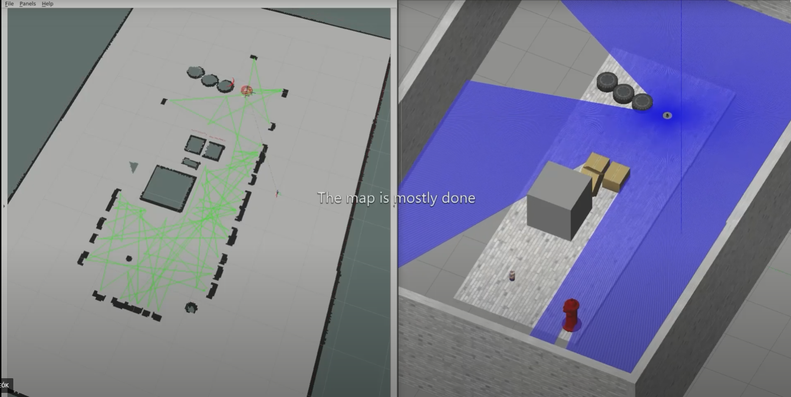

# Környezet felderítése leesésszenzor és ütközésszenzor segítségével

## Table of contents

1. [Bevezető](#Bevezető)
2. [Feladat leírása](#Feladat-leírása)
3. [Megvalósítás](#Megvalósítás)
4. [Eredmények](#Eredmények)

# Bevezető

A mai modern háztartásokban egyre népszerűbbek a különböző háztartási robotok, például robotporszívók. Ezeknél különösen fontos, hogy a "terepviszonyokat" felismerjék, a bútoroknak és egyéb környezeti elemeknek ne ütközzenek neki, illetve a lépcsőn se guruljanak le. Ennek elkerülése érdekében a robot szenzorokkal rendelkezik, melyeknek jelei alapján a beépített számítógép tudja irányítani a robot mozgását.


# Feladat leírása

Csapatunk feladata egy olyan virtuális, önjáró robot fejlesztése volt ROS környezetben, mely az általunk kialakított virtuális környezet elemeit érzékeli, azok között ütközés, illetve a pálya szélén leesés nélkül tud közlekedni. A robot random-bejáró algoritmus segítségével fel kell térképezze a környezetet.

# Megvalósítás

A feladatot ROS rendszerben valósítottuk meg, az órán megismert programok használatával, illetve a ROS Community modulok használatával.

A projekthez a következő csomagok telepítése szükséges:
* ros-noetic-full-desktop
* ros-noetic-hector-trajectory-server
* ros-noetic-hector-slam
* ros-noetic-map-server
* ros-noetic-gmapping

## A világ
A feladat megvalósításához létrehoztunk egy saját világot, ahol számos kihívás éri a robotot a térkép elkészítése során. Vannak különböző akadályok elhelyezve a térben, illetve le is eshet a "szakadékba".


## Geometria 
Robotunk geometriája egy hétköznapi robotporszívóra emlékeztet. Egy Z tengely mentén kihúzott lapos henger az alján az X tengelyen két kerékkel, melyeket differenciálisan hajtunk, illetve az Y tengelyre rögzített kettő darab szabadonfutó kerékkel, melyek a robot stabilitásáért felelősek, azonban nincsenek meghajtva. 


    

## Szenzorok 
A környezet érzékelésének érdekében a robotunk tetején, középen egy Lidar szenzort helyeztünk el, mely XY síkban pásztázza a környezetet, majd a visszaverődő lézerfényből távolságot számol és megadja a tereptárgyak illetve az érzékelő közötti távolságot. 

A leesést elkerülendő 3 darab ultrahangos közelségérzékelő szenzort helyeztünk el a robotunk alján egyet az elejére és egyet-egyet a szélekre. Az érzékelés iránya a Z tengellyel párhuzamos. Amennyiben a visszavert ultrahang hullámok a referenciaértéknél (a talaj és a szenzor távolsága) hosszabb idő alatt érkeznek vissza, a robot érzékeli a szakadékot. 

## Irányítás 
A robotunk irányítását a teleop.launch segítségével teszteltük.
Ezután egy random-bejáró algoritmust valósítottunk meg a robottal. Ezt a módszert alkalmazzák például robot-porszívók is egy adott tér bejárására. Az algoritmus pszeudókódja a következő:
```
init_movement()

while True:
    
    while (distance_of_closest_obstacle > reference_value) && fall_not_detected:
        move_forward()
    
    turn_random_angle()
```
Ehhez létrehoztunk egy node-ot amely feliratkozik a három távolságérzékelő és a lidar adataira. A lidar adatai közül csak arra van szükség, amit a robot maga előtt lát, ezért 50 fokos látószöget nézünk csak, és ezek közül a legközelebbi pontot választjuk ki. A node a szükséges mozgásnak megfelelő Twist üzenetet küld a /cmd_vel topicnak. A node scriptjét a random_move.py tartalmazza és létrehoztunk egy random_move.launch fájlt az indítására. 

## Térkép készítés
A térkép készítés során azt a megoldást választottuk, hogy 2 térképet készítünk, majd ezt egymásra illesztve készül el a teljes térkép. A lidar adataiból a gmapping csomaggal könnyedén készíthető térkép, így ezt implementáltuk. 

A távolságszenzor alapján történő térképalkotásra magunknak kellett megoldást találni. Létrehoztunk egy node-ot, amely feliratkozik a három távolságszenzor adataira. Inicializálunk egy, a gmapping térképével azonos OccupancyGrid térképet. Ez a térkép azt mondja meg, hogy egy adott pontjában mennyi a valószínűsége annak, hogy akadály van. Az algoritmusunk úgy működik, hogy a robot alatti területet akadálymentesnek jelöli, hiszen nem eshet le. Amint valamelyik szenzor a referencia távolságnál nagyobb értéket jelez, a szenzor helyén lévő területet akadálynak kell jelölni. Az ezt megvalósító python kódot a mapping.py tartalmazza. 

Ha megvan a két térkép, össze kell őket illeszteni. Az OccupancyGrid tulajdonságai miatt azt a megoldást választottuk, hogy a térkép minden mezőjén végigmegyünk, és a két értéket összehasonlítjuk és mindig a nagyobb értéket írjuk be a közös térképbe, ezzel biztosítva, hogy az összes akadály bekerül. Ezt a merge_maps.py valósítja meg és az all_mapping.launch fájllal mindhárom térképező node elindítható. A működését az alábbi ábra mutatja: 


 
## Eredmények

A készített node-okkal sikerült a feladatkírás minden pontjának eleget tenni, sikerült egy, akár újrahasználható projektet létrehozni. A projektünk rqt_graph-ja az alábbi ábrán látható. 


## Videó a működésről
<a href="https://youtu.be/d7yEBOIkYtg"></a>
